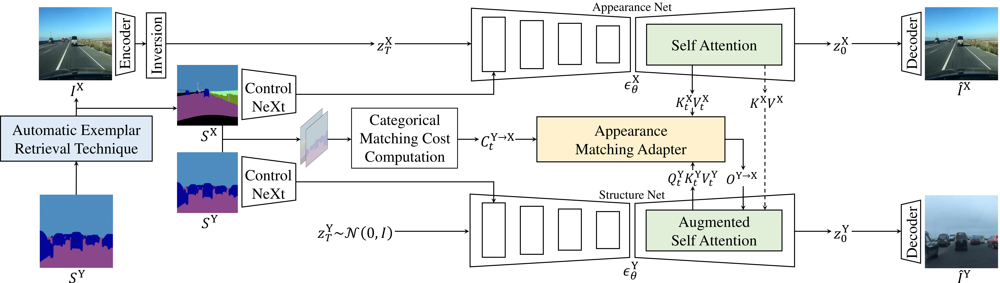

<div align="center">
<h1> [ICCV2025] AM-Adapter: Appearance Matching Adapter for Exemplar-based Semantic Image Synthesis in-the-Wild </h1>


[**Siyoon Jin**](https://scholar.google.com/citations?user=rXRHxkwAAAAJ&hl=ko&oi=ao)<sup>1</sup>, [**Jisu Nam**](https://scholar.google.com/citations?user=xakYe8MAAAAJ&hl=en)<sup>1</sup>, [**Jiyoung Kim**](https://scholar.google.co.kr/citations?user=DqG-ybIAAAAJ&hl=ko)<sup>1</sup>, [**Dahyun Chung**](https://scholar.google.com/citations?user=EU52riMAAAAJ&hl=ko&oi=sra)<sup>2</sup>, 

[**Yeong-Seok Kim**]()<sup>3</sup>, [**Joonhyung Park**]()<sup>3</sup>, [**HeonJeong Chu**]()<sup>3</sup>, [**Seungryong Kim**](https://scholar.google.com/citations?user=cIK1hS8AAAAJ&hl=ko&oi=ao)<sup>1</sup>

<sup>1</sup> KAIST AI &emsp;&emsp;&emsp;&emsp; <sup>2</sup> Korea University &emsp;&emsp;&emsp;&emsp; <sup>3</sup> Hyundai Mobis

<a href="https://arxiv.org/abs/2412.03150"></a>
<a href="https://cvlab-kaist.github.io/AM-Adapter/"></a>


</div>

<div align="center">
    
</div>

## Installation
```bash
conda create -n am_adapter python=3.10 
cd AM-Adapter 
pip install -r requirements.txt

cd diffusers
pip install -e .
cd ..
```

## Preparation 
### Model setting 
We will release the checkpoints soon! 

Download UNet, ControlNeXt and AM-Adapter checkpoints from the following URLs: 
| Model | Checkpoint |
|------|---|
| UNet | [model_1.safetensors]()|
| ControlNeXt | [model.safetensors]() |
| AM-Adapter | [matcher-25000.pth]() |

### Dataset
Please follow [dataset preparation](./src/dataset/README.md)

## Run Inference
### Parameter Setting
Modify the configuration file : configs/inference_adapter.yaml 

(1) Update the following paths to point to the corresponding checkpoint files :
 - ``pretrained_unet_path`` 
 - ``net.appearance_unet_path``
 - ``net.semantic_unet_path`` 
 - ``net.controlnext_path``
 - ``net.matcher_path`` 

(2) Set ``output_dir`` to define the directory where the results will be saved. 

(3) Set ``validation.validation_real_root_path`` to the BDD100K image directory and 
    set ``validation.validation_seg_root_path`` to the BDD100K label directory

```
# e.g.
validation:
    validation_seg_root_path : "/path/to/bdd100k/labels/sem_seg/colormaps"
    validation_real_root_path : "/path/to/bdd100k/images/10k/val" 
```

### Inference! 
1. Using Retreived Pairs from BDD100K

    (1) Set ``validation.version`` to ``"retrieval"`` and specify the path to the retrieval JSON file in ``valdiation.retrieval_json_path``.

    (2) Run the inference:
    ``` 
    python inference.py
    ```


2. Inference on Individual Samples

    (1) Set ``validation.version`` to "individual" 

    (2) Define the paths to real images(exemplars) and segmentation images(target):
    - ``validation.real_paths`` 
    - ``validation.seg_paths`` 

    (3) Run the inference:
    ```
    python inference.py
    ```

    Note that, $M$ exemplars and $N$ segmentation maps together produces $MN$ results.

To view (appearance, target, result) side by side, set ``validation.save_type`` to ``"triplet"``. 

If you only want to save the result, change it to ``"result_only"``.

## Citation
```
@misc{jin2025appearancematchingadapterexemplarbased,
      title={Appearance Matching Adapter for Exemplar-based Semantic Image Synthesis in-the-Wild}, 
      author={Siyoon Jin and Jisu Nam and Jiyoung Kim and Dahyun Chung and Yeong-Seok Kim and Joonhyung Park and Heonjeong Chu and Seungryong Kim},
      year={2025},
      eprint={2412.03150},
      archivePrefix={arXiv},
      primaryClass={cs.CV},
      url={https://arxiv.org/abs/2412.03150}, 
}
```